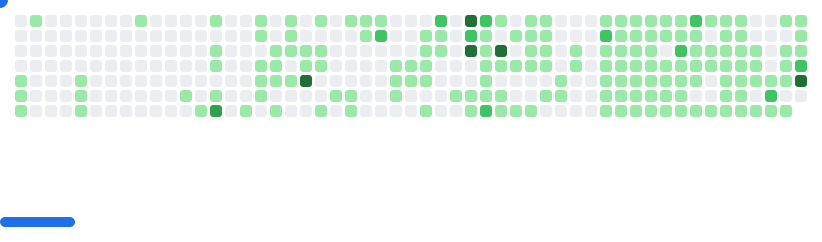

<!-- 🌠 Galactic Banner -->

  

<!-- 💻 Typing Animation (wide, no cutoff) -->

  

<h1 align="center">Hey, I’m Akshit Tiwari 🚀</h1>
<h3 align="center">B.Tech · Android Engineer · Geo‑AI Explorer · Open Source @ GSSoC’25</h3>

  
  
  
  

---

## 🛰️ Featured Project — Geospatial Help‑Bot (MOSDAC)

| Metric              | Value                    |
|---------------------|---------------------------|
| 🤖 Chatbot Model     | FAISS + BM25 + GPT        |
| 🌍 Geo Awareness     | Folium + Nominatim        |
| 📜 PDF & HTML Parsing | ✅                      |
| 📈 Intent Accuracy   | **92 %**                 |
| ⚡ Avg. Latency       | **1.7 s**                |
| 🧠 Knowledge Graph    | Neo4j                    |
| 🧪 Core Stack         | Python · Streamlit · spaCy |

> 📺 [Watch full demo](https://youtu.be/xDB5joiAe3Q)

---

## 🧠 Projects & Contributions
<!-- ❗ START OF PROJECTS SECTION ❗ -->

### 🚀 Major Builds
| Project |  Tech Stack | TL;DR |
|---------|-------------|-------|
| **Geospatial Help-Bot (MOSDAC)** | `Python` `Streamlit` `FAISS` `Neo4j` `LLM` | Chatbot that answers satellite data questions with maps & citations. 92 % intent accuracy. |
| **AI_ChatBot (GSSoC’25)** | `TypeScript` `LangChain` `FastAPI` | Open-source RAG bot contributed to GirlScript Summer of Code. |
| **Client Portfolio Website** | `Next.js` `Tailwind` `TS` | Production-ready portfolio template for freelance clients. |
| **DSA-IN-JAVA Notes** | `Java` | Concise cheat-sheets & code snippets for cracking DSA rounds. |

### 💡 Mini & Hackathon Projects
| Project | Stack | Summary |
|---------|-------|---------|
| **GitHack** | `Python` `Bash` | CLI that automates git commands and repo boiler-plating. |
| **italaco-future-forge** | `TypeScript` `Next.js` | Landing page concept for a startup hackathon. |
| **hindifinalapp** | `CSS` `HTML` | Language-learning PWA mock-up in Hindi. |
| **culinaryAI** (fork) | `TS` `OpenAI API` | Added recipe-generation improvements to upstream project. |

### 🌱 Learning / Sandbox
| Repo | What I’m Exploring |
|------|-------------------|
| **nextjs-commerce** (fork) | Studying advanced e-commerce patterns in Next.js. |
| **salesp07 profile fork** | Reverse-engineering advanced README animations. |

<!-- ❗ END OF PROJECTS SECTION ❗ -->

---

## 🔧 Skills & Tools

  

<!-- 🚀 Scrolling Tech Logos -->

  

---

<!-- 🏆 Trophy Case -->

  

---

## 📊 GitHub Metrics

  
  

---

## 🌌 Live Contribution Skyline & Aurora Graph

  

<!-- 🌌 Aurora Wave Contribution Calendar -->

  

---

<!-- 🎡 Neon Activity Rings -->

  

---

## ✨ Random Developer Quote

  

---

## 📫 Connect With Me

  
  
  

---

## 🧠 Fun Facts

- 🌙 I don’t just code at night — I *train* LLMs under the stars.  
- 🤯 I debug faster than GitHub loads in incognito mode.  
- 🎯 Goal: Real‑world satellite data products powered by AI.

---

> “Don’t aim to fit in — aim to *break the README template*.” – Me 😎

  <source
    media="(prefers-color-scheme: dark)"
    srcset="images/breakout-dark.svg"
  />
  <source
    media="(prefers-color-scheme: light)"
    srcset="images/breakout-light.svg"
  />
  

