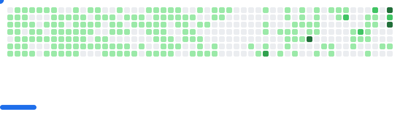

<!-- 🌠 Galactic Banner -->

  

<!-- 💻 Typing Animation (wide, no cutoff) -->

  

<h1 align="center">Hey, I’m Akshit Tiwari </h1>
<h3 align="center">Neurotitan · App Developer · Web Developer · Elite Coders (ECWoC25)</h3>

  
  
  
  

## 🔧 Skills & Tools

  

<!-- 🚀 Scrolling Tech Logos -->

  

---

   

---

## 📊 GitHub Metrics

  
  

---

<!-- 🌌 Aurora Wave Contribution Calendar -->

  

---

<!-- 🎡 Neon Activity Rings -->

  

---

## 📫 Connect With Me

  
  
  

---

- 🎯 Goal: Figuring things out.

---

> “Don’t aim to fit in — aim to *break the README template*.” – Me 😎

  <source
    media="(prefers-color-scheme: dark)"
    srcset="images/breakout-dark.svg"
  />
  <source
    media="(prefers-color-scheme: light)"
    srcset="images/breakout-light.svg"
  />
  

